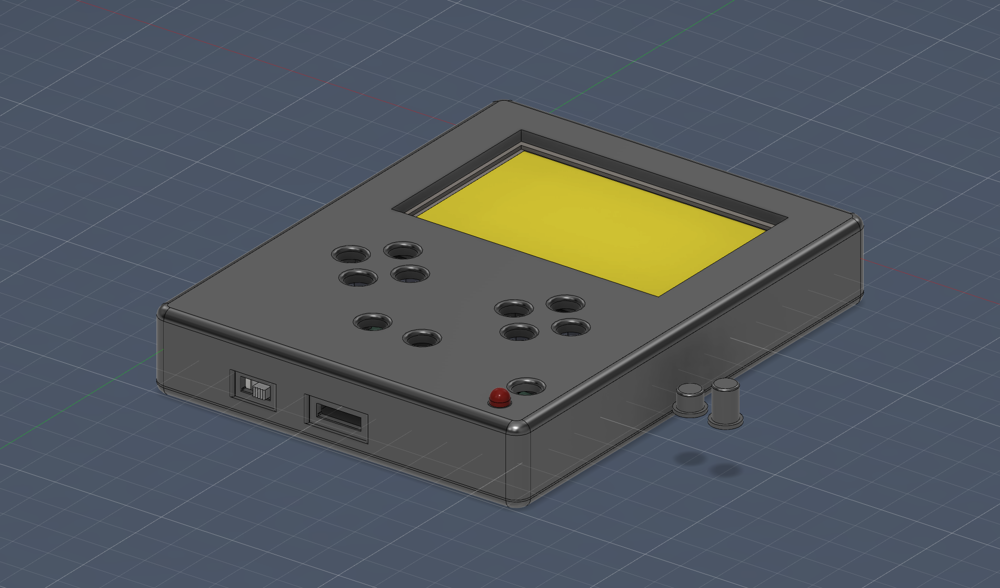
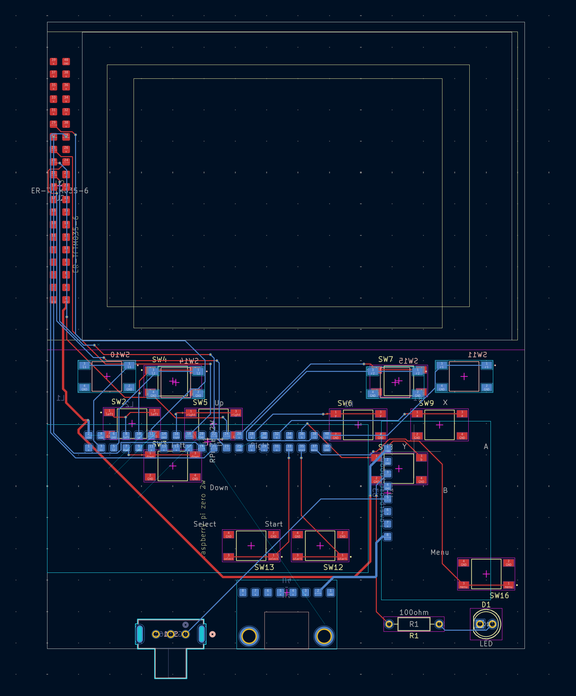

# pi-gba
A simple, easy to assemble, DIY retro gaming handheld.

The pi-gba was designed to be pretty easy to build. Order the pcb, parts, and 3d print the case, and assembly is straightforward. The pi, battery board, and usbc breakout are placed on top of and soldered directly to the main board.

### images

### software
Flash the latest image of [retropie](https://retropie.org.uk/download/) using the raspberry pi imager. Make sure SSH is enabled and ssh into the pi from another computer (instructions [here](https://retropie.org.uk/docs/SSH/)). 
I recommend installing the [fbcp-ili9341](https://github.com/juj/fbcp-ili9341) driver, clone the git repository and follow the instructions to build from source make sure to pass the flag `-DILI9488=ON` when compiling, as that is the driver that this project's screen uses. 
For keyboard controls I would use [retrogame](https://github.com/adafruit/Adafruit-Retrogame/tree/master), follow their instructions for install and then you should be able to use the `retrogame.cfg` from this repository.
Note this software has not been tested yet with this project.

| Item                    | Qty. | Price(USD) | Link                                                                                                    |
|-------------------------|------|------------|---------------------------------------------------------------------------------------------------------|
| ER-TFTM035-6            | 1    | 13.43      | https://www.buydisplay.com/lcd-3-5-inch-320x480-tft-display-module-optl-touch-screen-w-breakout-board   |
| BuyDisplay shipping     | 1    | 9.41       | N/A                                                                                                     |
| PowerBoost 1000         | 1    | 19.95      | https://www.digikey.com/en/products/detail/adafruit-industries-llc/2465/5356834                         |
| USB-C Breakout          | 1    | 2.95       | https://www.digikey.com/en/products/detail/adafruit-industries-llc/4090/9951930                         |
| TS04-66-55-BK-100-SMT   | 15   | 0.143      | https://www.digikey.com/en/products/detail/same-sky-formerly-cui-devices/TS04-66-55-BK-100-SMT/15634326 |
| LTL-307E                | 1    | 0.14       | https://www.digikey.com/en/products/detail/liteon/LTL-307E/669997                                       |
| CFM14JT100R             | 1    | 0.10       | https://www.digikey.com/en/products/detail/stackpole-electronics-inc/CFM14JT100R/1742057                |
| EG1206                  | 1    | 0.74       | https://www.digikey.com/en/products/detail/e-switch/EG1206/251333                                       |
| 2500mAh battery         | 1    | 14.95      | https://www.digikey.com/en/products/detail/e-switch/EG1206/251333                                       |
| Digikey Shipping        | 1    | 4.99       | N/A                                                                                                     |
| PCB                     | 1    | 9.00       | N/A                                                                                                     |
| JLCPCB Shipping + taxes | 1    | 39.44      | N/A                                                                                                     |
| Raspberry Pi Zero 2 W   | 1    | 19.05      | https://www.adafruit.com/product/5291                                                                   |
